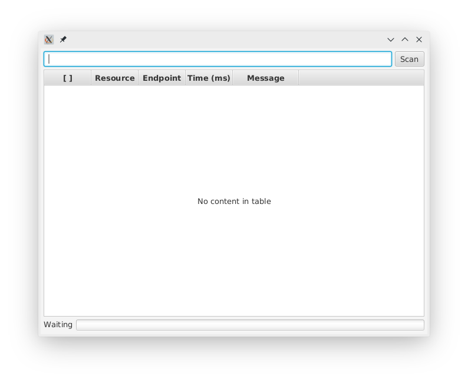

# Ethos Endpoint Checker in Java

Checks for available Ethos endpoints to see if they are working.

## Get Code
First thing we need to do is to grab the source.

1. Open cmd / powershell/ terminal
2. Change directories to where you want the code downloaded to.
3. Clone the repository with git [(download git)](https://git-scm.com/downloads):
`git clone https://github.com/asaladino/ethos-endpoint-checker-java`

## Add an API key
The API key is in /docs/sample.json
 1. Open file in text editor and add the API key
 
## Only Check Option
In the json config file (ie: /docs/sample.json) you can add an option to only check specific
endpoints. Your configuration might look like:

```json
{
  "ethosApiKey": "your-api-key",
  "onlyCheck": [
    "accounting-string-formats",
    "accounting-string-components",
    "accounting-strings"
  ]
}
```

By removing `onlyCheck` or leaving `onlyCheck: []` empty in your config, all endpoints will be checked.

## Build Jar
To build the jar file for deployment you will need to have gradle installed
 [(download gradle)](https://gradle.org/install/).

1. Open cmd / powershell/ terminal
2. Change directories to where you checked out the code: `./ethos-endpoint-checker-java`
3. The run: `gradle clean build`

Your jar file has been generated and is located at `./build/libs/ethos-endpoint-checker-java.jar`

## Run Jar
This jar file can be deployed anywhere java is installed and run from the command:

```
java -jar ./build/libs/ethos-endpoint-checker-java-1.0.jar ./docs/sample.json
Starting
Loading: ./docs/sample.json
Getting the ethos api key.
Getting all the endpoints.
Found 1 available resources.
Found 275 in Colleague by Ellucian
✅ | academic-periods                                 |   4484 ms | (188) [{"category":{"type":"subterm","parent":
✅ | courses                                          |   1045 ms | (200) [{"titles":[{"type":{"id":"3432-da13
✅ | persons                                          |   5691 ms | (100) [{"privacyStatus":{"privacyCategory":"un
✅ | persons-credentials                              |   4299 ms | (200) [{"id":"adfafa234-a875-df-342-23
✅ | sections                                         |   6758 ms | (100) [{"titles":[{"type":{"id":"463623b6-f3ee
✅ | section-registrations                            |   1430 ms | (100) [{"registrant":{"id":"afadf234-1c04-4da3
✅ | academic-catalogs                                |   1077 ms |  (21) [{"startOn":"1999-07-01T00:00:00","endOn
✅ | academic-credentials                             |    761 ms |  (77) [{"type":"certificate","abbreviation":"C
✅ | academic-disciplines                             |   1228 ms | (161) [{"type":"major","reporting":[{"country"
✅ | academic-honors                                  |    817 ms |  (29) [{"type":"distinction","code":"adfa","t
✅ | academic-levels                                  |    614 ms |  (18) [{"code":"df","title":"@ adfasdfd L
✅ | academic-period-enrollment-statuses              |    409 ms |   (5) [{"code":"A","title":"Active","descripti
✅ | academic-programs                                |   2048 ms | (297) [{"authorizing":{"institution":{"id":"6e
✅ | academic-standings                               |    407 ms |  (22) [{"code":"adf","title":"df, Progress Pr
❌ | account-funds-available-transactions             |    352 ms | java.lang.IllegalStateException: Expected BEGIN_ARRAY but was BEGIN_OBJECT at line 1 column 2 path $
✅ | accounting-codes                                 |   1490 ms | (127) [{"category":{"usage":"accountsReceivabl
```

If no config file is specified or the `jar` file is double clicked, the GUI will open:

